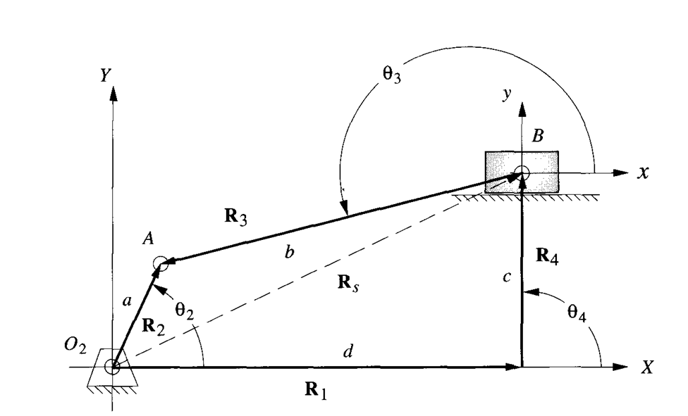

### Acceleration Analysis

Differentiating the earlier equations from velocity analysis, we end up with the acceleration data of the slider crank. With the prior knowledge of the angular acceleration of the crank,α2 the parameters such as the linear acceleration of the slider, 𝔞s, and the angular acceleration of the coupler, α3

